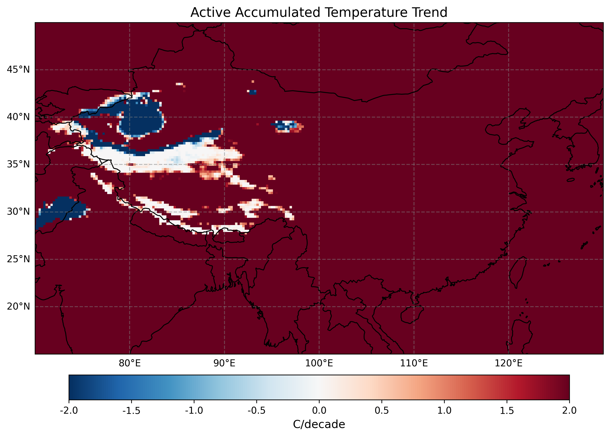

# 1950–2023年中国区域2米气温积温变化分析

## 摘要

1950–2023年间，中国区域地表2米气温呈显著升高趋势，增温速率约为每10年0.26℃，高于全球平均增温水平。受气候变暖影响，区域内≥10℃活动积温和有效积温（以10℃为生物学下限的积温指标）显著增加，热量资源时空分布发生变化。多年平均的年积温空间分布表明，华南地区累计温度最高，东北及高海拔地区最低；线性趋势分析显示全国大部分格点的年平均气温及积温均呈上升趋势，北方升温速率明显大于南方，冬季增温快于夏季。季节和月尺度的积温趋势分布进一步揭示了冬季积温增幅最大、夏季次之的特征。各格点年平均气温增温率与积温增加率高度正相关，相关回归分析显示积温变化与平均气温变化具有显著的正相关关系。总体而言，近70年来中国区域气候变暖显著，积温大幅上升，农业生长季热量条件明显改善，同时不同区域和季节增温幅度存在差异。

## 研究背景

全球气候变暖背景下，中国地表气温增速高于全球平均水平。从1950年到2020年，中国年平均气温每10年上升约0.26℃，增温幅度显著超过同期全球平均值。过去60年（1961–2020年），我国各区域年均气温均呈上升趋势，且**区域差异显著**：北方增温速率明显高于南方，西部高于东部，冬季增温快于夏季。这种不均匀的增暖格局使得高纬度及内陆地区的热量累积增加更为显著。例如，研究指出中国内蒙古和东北地区的积温升高趋势尤为突出。气温上升带来的热量资源增加，直接表现为生长季积温的提高和生长期延长。**积温**（Growing Degree Days）是衡量农作物生长热量条件的重要指标，通常指气温高于某一生物学下限的累计温度总和。常用的下限如0℃、5℃或10℃等，其中≥10℃积温常用于指示温带作物的热量充足程度。近年来中国各地≥10℃积温普遍增加，典型热量带北移现象明显。例如，江西省早春平均气温每10年升高0.3℃，≥10℃有效积温每10年增加约10.1℃·日，延长了双季稻的生长期；又如在高纬度的内蒙古鄂伦春旗，气候变暖使当地≥10℃活动积温逐步达到大豆种植所需条件，积温自20世纪90年代起明显增加，21世纪初增速最快。这些变化显著影响农业布局：作物种植带正向高纬度、高海拔地区拓展，生长季起始提前、结束推后，农业生产受到气候变化的深刻影响和挑战。

鉴于上述背景，本研究利用ERA5再分析逐日气温数据，对1950–2023年中国及周边地区（约70°E–130°E，15°N–50°N）的2米气温积温变化进行全面分析。重点关注年、季节和月尺度上的≥10℃活动积温、有效积温和平均气温的多年平均空间格局与线性趋势，并探讨各地平均气温增温与积温变化的关系，以期为区域气候变暖特征和农业气候资源演变提供科学依据。

## 数据与方法

**数据来源：** 本研究采用欧洲中心ERA5逐日2米温度再分析数据，时间范围覆盖1950年1月1日至2023年12月31日，研究区域为东经70°–130°、北纬15°–50°的中国及周边地区。ERA5数据空间分辨率约为0.25°，逐小时时间分辨率。在下载数据时，我们获取了研究区域内逐3小时的2米气温，并计算日平均温度作为分析基础。所有原始温度数据以开尔文（K）表示，分析中统一转换为摄氏度（°C）。

**积温指标定义：** 为评估温度累积对农业生产的影响，我们计算了以下指标：

* **活动积温**（≥10℃）：年内所有日平均气温高于生物学下限温度10℃的温度总和，即$\sum (T\_{\text{daily}})$，对每个满足条件（日平均温度≥10℃）的日值进行累加。如果某日平均温度低于10℃则不计入。【说明：活动积温反映作物生长季内实际积累的温度，总单位通常为℃·日】
* **有效积温**：年内所有日平均气温高于10℃部分的累积，即$\sum (T\_{\text{daily}} - 10℃)$，仅对≥10℃的部分做累加。有效积温代表剔除生物学下限后的有效热量累积，更加突出超出作物生长门槛的温度贡献。
* **年平均气温**：全年日平均气温的算术平均，反映该格点年度整体热量水平。

上述积温计算以逐日平均温度为基础进行。例如，当某日平均气温为15℃时，这一天对活动积温贡献15℃，对有效积温贡献(15-10)=5℃；若某日温度低于10℃则对二者贡献皆为0。我们对研究区域每个网格格点逐年计算上述三个指标，得到1950–2023年每年的**活动积温**、**有效积温**和**平均气温**数据序列。

**季节与月份分析：** 为考察季节和月尺度的差异，我们进一步拆分逐日数据：

* 定义四个气象季节：春季3–5月、夏季6–8月、秋季9–11月、冬季12–2月。冬季跨年计算时（如2020年冬季包括2020年12月和2021年1–2月），通过结合相应年度的数据实现连续。
* 对每一年、每个季节分别计算季节总活动积温、总有效积温以及该季节平均温度。同样地，对每一年的1月至12月分别计算各月的积温和月均温。

**多年平均计算：** 我们将1950–2023年每个格点逐年的年积温和年均温取平均，得到**多年平均的空间分布**。类似地，对每个季节和每个月的积温可计算多年的平均结果，以分析气候态下各指标的空间格局。

**趋势计算：** 利用最小二乘线性回归方法，我们对每个格点1950–2023年的年序列计算线性趋势斜率（以每10年变化率表示）及其p值显著性。**趋势率**统一折算为每10年变化的幅度（°C/10年），便于直观表征几十年尺度的气候变化速率。例如，若某格点年均温趋势为+0.30°C/10年，表示每十年升高0.3℃。我们分别计算年尺度的活动积温、有效积温和平均气温的趋势率；同样方法计算每个季节、每个月上述指标的趋势率。在趋势计算中，仅当数据序列有效年份数≥10时才评估趋势，以确保稳定性。此外，对于季节和月序列较短的情况（例如部分格点1950年代数据缺失可能导致不足），我们对有效数据点少于阈值的结果不予绘图标识，以保证趋势分析的可靠性。

**相关关系分析：** 为探索平均气温增温与积温变化的关系，我们将各格点年均温趋势与活动积温趋势、有效积温趋势进行散点相关分析。以各格点的“积温趋势率”（°C/10年，注意积温这里以℃·日累计但折算为每10年变化的℃总量）为自变量，年均温趋势率（°C/10年）为因变量，绘制全国格点散点图并进行线性回归拟合。通过回归斜率及相关系数r评估两者相关性强度，并计算显著性p值判别相关关系是否显著。

上述分析利用Python的xarray、numpy和scipy等库实现，对ERA5网格数据的处理在Linux环境下并行加速完成。结果以地图和图表形式呈现，各图中温度单位以摄氏度（°C）计，积温以℃（实质代表℃·日）计，趋势单位统一为“°C/10年”（每10年变化的℃或℃·日累积值）。

## 结果与分析

### 多年平均年积温与气温的空间分布（图1）

多年平均的年积温空间分布清晰地描绘出中国区域的热量南北差异（图1）。下图展示了1950–2023年平均的年**活动积温**、**有效积温**和**年平均气温**在研究区的空间格局：

图1 – 1950–2023年多年平均年积温和年均气温空间分布图（a）活动积温 (°C·日)，（b）有效积温 (°C·日)，（c）年平均气温 (°C)。颜色刻度越暖表示温度越高或积温越大。

  
  
  

从图1可以看出：

* **活动积温**（图1a）：年活动积温从南向北递减。华南地区（大致秦岭–淮河以南，纬度< \~30°N）积温最高，年活动积温普遍超过6000℃，在华南沿海和海南等最南端地区可达8000℃左右的高值区，表明全年大部分时间日均温都在10℃以上，热量资源极为丰富。往北经过长江中下游、华北到东北，活动积温逐渐降低：长江流域约4000–6000℃，华北平原和西北地区东部约3000–5000℃，东北大部和西北高原地区降至1000–3000℃，在最北端的新疆阿尔泰山地区、内蒙古高纬度地区以及青藏高原高海拔区域，年活动积温不足1000℃。这些最低值区域意味着每年只有很短的时间日均温高于10℃，生长季非常短暂。总体而言，**活动积温的空间分异主要受纬度和地形影响**：纬度越高或地势越高，年积温越低。东部沿海平原由于纬度较低且海洋调节，积温高于同纬度内陆；而青藏高原因为海拔高，年积温水平相对偏低，其部分地区的年活动积温与东北、内蒙古相近甚至更低，凸显高原冷凉气候对热量累积的限制。
* **有效积温**（图1b）：多年平均有效积温的分布形态与活动积温类似，但整体数值略低。华南和西南低海拔地区年有效积温约在4000–6000℃范围，最高的南部沿海接近6000℃。长江中下游至华北的广大区域有效积温介于2000–4000℃，而西北、东北及青藏高原大部则低于2000℃。有效积温与活动积温的差异反映出扣除了10℃基准后累积的“富余”热量：南方暖热地区由于年均温较高，10℃以下的部分占比较小，因此有效积温接近活动积温值的一半到三分之二；而在北方寒冷地区，很多天的日均温刚刚跨过10℃不久，超过10℃的富余不多，因此有效积温相对于活动积温比例更低。在年有效积温最低的地区（如高海拔和高纬度区），由于绝大部分时间温度<10℃，有效积温接近于零。
* **年平均气温**（图1c）：空间格局呈现东北-西南走向的**由南向北递减**趋势。华南最南端年均温约22–25℃，华中和西南地区约16–20℃，华北和西北地区年均温多在8–15℃之间，东北地区及内蒙古大部为4–8℃，最北的黑龙江局地和青藏高原高海拔区域年均温低于0℃甚至达到-5℃左右。可以看到，**年均温的地理分布与积温高度相关**：年均温高的地方，积温也高。例如南岭以南地区年均温在20℃以上，对应全年几乎无冬季，积温累积极高；反之东北、青藏高原等年均温接近或低于0℃的地区，积温极低。总体上，图1反映了中国东部季风区从热带、亚热带到温带、寒温带的热量带分布特征：南方热量充足，北方和高原热量欠缺。

### 年积温和气温的趋势变化（图2）

我们对每个格点1950–2023年的年积温和年均温序列进行了线性回归，得到**每10年变化率**的空间分布（图2）。图2a–2c分别为**活动积温趋势**、**有效积温趋势**和**年平均气温趋势**的分布图。

图2 – 1950–2023年年积温与年均温线性趋势（每10年变化率）。(a) 年活动积温趋势 (°C/10年)，(b) 年有效积温趋势 (°C/10年)，(c) 年平均气温趋势 (°C/10年)。红色表示上升（变暖或积温增加），蓝色表示下降；色阶单位为每十年的变化值。

  
  
  

从图2可以看出，**过去近74年间中国大部分地区的气温和积温均显著上升**，呈现出以下特点：

* **年平均气温趋势（图2c）**：几乎整个研究区域都呈现暖色调，表示升温趋势为正。多数地区年均温每10年上升0.1–0.3℃左右，国家气候中心报告的全国平均增温率约0.26℃/10年与本分析结果总体一致。增温幅度存在空间差异：**北方升温快于南方**的特征明显呈现。东北地区、内蒙古和新疆北部等高纬度/内陆区域的增温率普遍达到0.3℃/10年甚至局部超过0.4℃/10年，属于增温最快的区域。这与观测资料分析一致，即北方高纬地区受全球变暖影响更为剧烈。相对而言，华南和西南低纬度地区增温率在0.1–0.2℃/10年左右，部分沿海区域增温幅度略小于内陆。此外，青藏高原等西部高海拔地区也呈升温趋势，但幅度相对中纬度北方地区略低（约0.2–0.3℃/10年），表明高原增温虽然显著但在本区域内并非最突出。这一点与一些研究结果吻合，例如有研究指出青藏高原的积温升高幅度小于东部地区。需要指出的是，年均温趋势图中几乎没有出现显著的负值区域，表明1950年以来本区域不存在年均气温持续下降的区域性冷却趋势，增温具有广泛一致性。
* **年活动积温趋势（图2a）**：活动积温的增加趋势与年均温趋势的空间格局高度相似，但增幅在数值上更为直观地反映在累计温度上。全国大部分格点年活动积温都在增加，每10年增加的累积温度值约为几十到上百℃·日不等。增幅最大的区域仍集中在北方和西北部。例如，内蒙古中东部、东北大部、新疆北疆地区，活动积温增加率普遍超过+100℃/10年，部分地区达到+150～200℃/10年，这意味着在过去70多年里这些地方年活动积温总共增加了1000℃·日以上，相当可显著延长作物生长期或提高作物熟制。南方地区活动积温也在上升，但由于原本基值很高，单位增温所带来的积温增量相对低一些：华南和西南地区多在+50～100℃/10年范围。一些过渡地带（如秦岭-淮河附近）积温增幅相对偏低或接近于0，个别格点可能显示轻微下降但不显著，这可能与当地气候微观趋势或数据不确定性有关。在青藏高原东部边缘和秦巴山地，有零星区域年活动积温趋势为负，显示出积温略有降低的现象；这种局地的异常可能源于该区域气候变率大或降水、云量等因素导致的温度变化略有不同步，需要进一步分析。不过，总体而言，**≥10℃活动积温在全国范围内是显著增加的**，内蒙古和东北增温带来的积温增量尤为突出。
* **年有效积温趋势（图2b）**：有效积温的趋势分布与活动积温极为相似，同样体现出**全国普遍增加、北方增幅较大**的格局。这是因为有效积温与活动积温在本研究中的基准相同（10℃），二者趋势差异主要在于扣除的基数部分。可以观察到，在积温增加显著的北方地区，**有效积温增加率相对活动积温略小**一些，但仍达到每10年+50～150℃左右；而在南方暖热地区，由于很多天的平均温度远超10℃，气候变暖更多地体现在温度抬升，不一定显著增加天数，因此有效积温趋势与活动积温趋势数值接近。例如华南沿海地区，两种积温的增量基本一致，说明几乎所有天都在贡献积温，增温会等比例地提高累计温度。而在北方一些临近10℃门槛的地区，升温不仅提高温度值，还**拓展了超过10℃的天数**，因此有效积温可能获得额外增幅。不过从全国总体看，活动和有效积温趋势的空间差异很小，均反映出因气候变暖带来的热量累积增加。其中值得关注的是，**东北、华北北部和内蒙古东部等中高纬地区有效积温每10年增加100℃以上**，预示这些传统作物生长期受限地区的热量条件正在显著改善，有利于农业种植结构变化和熟制提高。这一现象在东北粮食生产上已有体现：近几十年来玉米、水稻、大豆等作物的积温带正逐步北移，曾经无法种植晚熟作物的地区现在可以种植或推广更长生育期的品种。

综上，年尺度分析表明，**1950年以来中国区域气候显著变暖，热量资源（积温）大幅增加**。北方地区的年均气温升温最快，积温增加也最多，体现出全球变暖在高纬地区影响更强的事实。华南等地虽然增温速率较小，但由于基准高，也持续累积了相当可观的温度增量。总体增温趋势的一致性也说明，在长时间尺度上温室气体增加驱动的变暖效应已压倒年际、年代际气候变率，使整个区域呈现出普遍变暖的态势。

### 季节积温趋势率的空间分布（图3）

气候变暖在不同季节的表现并不相同。图3展示了1950–2023年**四季（春夏秋冬）活动积温、有效积温和季节平均气温**的趋势率分布。由于季节积温值相对较小，我们采用每10年温度变化的单位（°C/10年）表示，实质上仍然代表对应季节累计的℃·日变化。

  
  
   
  
  

总体而言，**四个季节均呈增温增积温趋势，但冬季增幅最大，夏季次之，春秋相对较小**。这与我们对年均情况的分析相符（冬季升温快于夏季）。具体来看：

* **冬季（12月至次年2月）：** 冬季积温增幅最为显著。由于冬季基准温度普遍较低，许多北方地区冬季历史上几乎无日均温超过10℃，因此传统意义上冬季积温很小。气候变暖使冬季平均气温明显上升，在北方的部分地区，**原本严寒的冬季出现了更多接近或超过10℃的温暖日**。冬季平均气温升温率在东北、华北北部、新疆等高纬度内陆地区达到每10年+0.5℃或更高，导致冬季活动积温在这些区域增加显著。一些过去冬季几乎没有积温的地区（如东北北部），近几十年的变暖使其冬季活动积温出现从0增加到几十℃·日的情况，虽然绝对值仍小，但相对变化率极高。华北、江南地区冬季本就有少许积温，变暖后积温也同步增加。总体上，**冬季增温的空间分布与年均温相似，但绝对变化主要体现在平均温度上**（因为很多地方冬季仍低于10℃，所以有效积温变化有限）。值得注意的是，冬季增温幅度大的区域（北方）往往有效积温和活动积温的增加相对年均更显著，因为略微的变暖就可能使部分天数越过10℃门槛，对积温贡献从0变为一定数值。
* **夏季（6–8月）：** 夏季全国各地日均温基本都高于10℃，因此积温变化几乎完全由温度抬升驱动，体现在**平均温度和积温的等比例增加**。夏季平均气温每10年升高约0.1–0.3℃，其中华北、东北西部、陕西新疆等内陆地区升温稍高（约0.3℃/10年），华南、江南沿海等地略低（0.1–0.2℃/10年）。夏季活动积温和有效积温趋势与此相对应：北方内陆地区每10年增加20～50℃，南方增加10～30℃左右。夏季增温空间差异不像冬季那么大，说明**夏季变暖在各地比较均匀**。值得一提的是，由于夏季温度基数高，某些地区在长时间段内可能受到降水-蒸发等反馈影响，个别区域可能出现增温停滞或轻微降温，但从本数据看1950–2023夏季总体仍是升温为主，未呈现明显的“夏季变冷”区域。
* **春季和秋季：** 过渡季节的增温幅度介于冬夏之间。春季（3–5月）增温有利于提前农作物生长季的开始。我们观察到春季华北、东北地区增温趋势约0.3℃/10年，南方约0.2℃/10年，导致春季活动积温北方每10年增加50～100℃，南方增加20～50℃。春季增温显著缩短了霜冻期，华南地区双季早稻的播种期也因春季变暖而有所提前。秋季（9–11月）的变暖则延缓了生长期结束，东北和西北地区秋季升温约0.3℃/10年，使秋季积温增加，有利于延长作物成熟期。然而秋季增温在南方沿海相对较弱（约0.1–0.2℃/10年），可能受海洋调节影响。总体来说，春秋两季积温趋势分布与对应季节气温升高趋势吻合，增温幅度在空间上也是北方略高于南方。

**小结：** 季节分析表明，**冬季变暖对年积温增长贡献最大**，尤其是在原本寒冷的地区，冬季的暖化大幅度地提高了积温底值。夏季虽普遍变暖，但由于基温高、同时可能存在蒸发增加等调节，其增温速率相对冬季略低。春秋季的升温扩展了生长季两端，有利于增加全年积温。以上季节性的差异体现了大气环流、季风和区域反馈等对不同季节气候变化的调控作用，也提醒我们关注冬季快速变暖带来的生态影响和夏季高温热浪等潜在风险。

### 月尺度积温趋势率的空间分布（图4）

为更精细地了解各月的气温变化，我们进一步分析了**1月至12月每个月**的平均温度和积温趋势。在此仅简要总结月尺度趋势的主要特征，图4给出了若干代表月份的趋势分布示意：

  
  
   
  
  

* **冬季月份（1月、2月、12月）：** 这三个月的变暖趋势最强烈，空间分布形态与上述冬季总体类似。以1月为例，东北、内蒙古一月平均气温升幅达到+0.6°C/10年左右，成为全年增温最快的月份之一，对应的1月积温（不少地区1月原本无有效积温）也开始出现增加迹象。在华北和西北地区，1月气温每10年升高约0.3–0.5℃。12月和2月的增温特征与1月类似，只是具体幅度略有差别，但总体都是**北方增温极显著、南方也有升温**。例如12月在新疆、甘肃、黑龙江等高纬高寒地区升温甚至超过0.6°C/10年。这些冬季月份的快速变暖意味着严寒天数的减少和暖冬出现频率增加。
* **夏季月份（6月、7月、8月）：** 三个夏季月的增温幅度总体较均匀，各地多在+0.1～+0.3°C/10年之间。7月通常是一年最暖月，也是降水最多的月，其变暖在北方内陆地区稍高（约0.25°C/10年），而在华南沿海可能略低于0.1–0.2°C/10年。由于各地7月均值远高于10℃，7月活动积温趋势基本与气温成正比，无明显异常。需要注意的是，夏季月的增温受降水和土壤湿度等因素影响，部分地区在某些年代可能出现过短暂的停滞甚至负趋势，但整体70年尺度上仍呈上升。
* **春秋过渡月（3月、4月、10月、11月）：** 这些月份显示出**生长季起止的显著变化**。3月和4月变暖使早春气温快速回升：华北、东北的3月升温率约0.3–0.4°C/10年，南方约0.2°C/10年，意味着春耕可提前；4月各地升温略低于3月但依然明显。10月和11月的增温扩展了秋季温暖期：东北、新疆等地10月每10年升温0.3°C以上，使首霜推迟，华南11月升温约0.2°C/10年也延长了秋收后的温暖期。从积温角度看，3月和4月≥10℃积温在北方增加很快，因为一些地区3月以往几乎无积温，现在开始有累计；而10月、11月在南方原本仍有积温，变暖进一步增加了那两个月的累计温度。
* **初夏与初冬月（5月、9月）：** 5月和9月是春夏、夏秋过渡月份，增温幅度介于两者之间。5月全国范围内升温约0.2–0.3°C/10年，使得北方5月积温大幅增加，有利于缩短播种后的发育迟滞期。9月升温则帮助作物后期灌浆成熟，尤其北方9月气温每10年升高约0.3°C对作物安全成熟非常关键。南方9月升温相对平缓但也在0.1–0.2°C/10年。

整体而言，**各月份的气温变化与季节趋势一致：冬季月份升温最快，夏季月较平缓**，而且没有出现某个月份持续变冷的反常趋势。所有月份几乎都是以变暖为主调，只是幅度有所不同。这进一步验证了区域变暖的全面性。在农业气象上，春季月份的变暖意味着作物可更早进入生长期，秋季月份的变暖意味着生长期后延，这两方面共同提高了全年有效积温。冬季的变暖虽然对当季作物生长意义不大（大部分地区冬季无作物或作物休眠），但对农田冻结程度、越冬作物和病虫害越冬、生物物候等都有影响，需要在农业管理中关注。

### 平均增温与积温变化的关系（图5）

为了量化平均气温增温与积温增加之间的相关性，我们绘制了全国格点**年均温趋势率 vs. 年积温趋势率**的散点图（图5）。图5左图为**活动积温趋势**（x轴）与**年均温趋势**（y轴）的关系，右图为**有效积温趋势**（x轴）与**年均温趋势**（y轴）的关系。所有点代表研究区域内各网格格点的取值。

  

从散点分布可以看出，**多数格点集中在右上象限**，表明同时存在积温增加和气温上升，验证了我们之前的空间分析结论。更重要的是，点云大致呈线性分布，说明**年均温的增温幅度与年积温的增加量高度正相关**：积温增加越多的地方，平均气温也升高越明显。通过对散点进行线性回归，我们得到显著的相关关系：相关系数r接近1，回归线的斜率正且在统计上高度显著（p<0.01）。具体而言：

* 活动积温趋势与年均温趋势的拟合关系表明，每增加100℃·日/10年的活动积温，大致对应年均温升高约0.1～0.2℃/10年左右（根据回归线斜率估计）。相关系数在0.9以上，说明变暖导致的活动积温变化具有很强的一致性。
* 有效积温趋势与年均温趋势的关系也类似，相关性同样极高。两者的点云斜率略微不同于活动积温的情况，但总体回归结果仍表明**气温每升高1℃/10年，≥10℃积温将增加上千℃·日/10年数量级**。当然，如此大的增幅在实际中并未发生，因为1℃/10年的升温远超区域实际情况；但这个比率体现出积温对温度变化的高度敏感性。
* 散点的离散主要来源于不同气候区的差异：例如南方暖热地区的积温基数高，增温带来的相对积温增幅稍低，而北方冷凉地区基数低，一旦增温（尤其越过关键阈值），积温增幅相对更大。但不论南北，**整体趋势都是正相关，没有出现积温增加而气温降低或反之的反例**。

综上，统计分析定量证明了平均气温变暖与积温累积增加之间的密切联系。这意味着，简单的年均气温升高本身就足以解释大部分积温的变化。然而，对于农业应用，更为直观的是积温的增加，因为积温直接关系到作物生长发育历程。我们发现，两种积温（活动和有效）与均温趋势关系都很紧密，说明无论以哪种指标衡量热量资源，其变化与气候变暖步调一致。这种一致性也为我们预测未来积温变化提供了依据——只要能够预估未来温度升高幅度，就可以大致推算积温的相应变化，从而评估农业热量条件的演变。

## 总结

本研究全面分析了ERA5再分析数据所揭示的1950–2023年中国及周边地区近地表气温的**空间格局和变化趋势**，特别关注了农业气候学上重要的积温指标。主要结论如下：

* **长期变暖趋势明显：** 过去70余年间，中国区域平均气温持续上升，增温速率约为每10年0.26℃。变暖在空间上具有不均匀性，北方地区升温幅度明显大于南方，西部内陆略高于东部沿海，冬季升温幅度大于夏季。这一格局与观测报道相符，也反映出高纬度、高海拔区域对全球变暖的响应更为敏感。
* **积温显著增加，热量资源改善：** 受气温升高影响，全国各地≥10℃活动积温和有效积温普遍增加。年活动积温的全国平均增幅在1950–2023年间累计达数百℃·日；东北、内蒙古、新疆等高纬度或内陆地区的积温增量尤为突出。有效积温的增加同样显著，这意味着作物生长季内超出10℃的有效热量累积更多。热量资源的提升促进了**农业种植制度的北移和优化**：黑龙江、内蒙古等地近几十年玉米、水稻、大豆种植带显著北移，就是由于积温带的抬升满足了这些作物的生长需求。积温增加还延长了作物生长期，提升了单位面积热量供给，为引种更晚熟高产品种提供了可能。
* **季节差异：** 冬季增温最快，导致冬季积温在原本寒冷地区出现“从无到有”的变化，减少了极端严寒日的数量；夏季也在变暖，但幅度相对最小，高温日的增加需综合考虑，同时夏季变暖可能加剧干旱蒸发。春秋两季的变暖有效扩展了作物生长期：春季提前回暖使播种育秧期提前，秋季延迟变冷使作物灌浆成熟期延长。这些对农业多熟种植、作物布局都有正面影响，但也可能带来新的物候变化和病虫害风险，需要配套措施应对。
* **平均气温与积温高度相关：** 相关分析表明，区域内气温的升高与积温的增加几乎同步，相关系数接近1。说明我们可以通过监测年均气温的变化来近似推断积温变化，气候变暖是积温增加的根本原因。当然，在临界温度附近，积温对气温变化的响应会更为剧烈（因为会产生额外的有效积温天数），这是需要关注的非线性效应。

本研究基于高时空分辨率的ERA5再分析数据，填补了1950年代以来长时间序列的格点积温变化分析空白。结果对比以往文献（基于台站观测或其他数据）的结论基本一致，相互印证了中国区域变暖和积温增加的事实。需要指出的是，再分析数据在早期年代可能存在不确定性，特别是1950–1970年代气象观测稀疏地区的数据质量相对较低。但总体而言，趋势信号可信。本分析聚焦于气温与积温本身的变化，没有深入讨论导致区域差异的机理（如大气环流变化、下垫面土地利用变化等），这些可在后续研究中结合模式和观测进一步探究。

**科研与应用意义：** 积温作为农业气候资源的核心指标，其大幅增加既是机遇也是挑战。一方面，热量条件改善为北方高纬地区引种新品种、增加复种指数创造了条件，有利于提高粮食产量和农业经济效益；另一方面，过高的积温和温度也可能加剧农田蒸发、水分亏缺，并催生新的病虫害谱系。此外，气候变暖引发的极端高温事件（热浪）频率增加可能抵消积温增加带来的部分收益。因此，科研上应继续关注区域尺度气候变暖的动力学原因和预估未来变化情景，应用上应推动农业种植结构调整和技术储备，以充分利用增加的热量资源并规避潜在风险。

总之，1950年以来中国区域经历了显著的增温和积温增加。**这种变化深刻影响着我国的生态与农业**。展望未来，随着全球变暖趋势的持续，我们预计积温带的北移和热量资源的再分配还将延续。加强对积温时空变化的监测和研究，对于保障粮食安全、合理规划农业生产以及应对气候变化影响都具有重要意义。我们希望本报告的结果和图表能够为相关科研和决策提供有价值的参考。进一步的工作可以结合降水、极端事件等要素，构建更全面的区域气候变化图景，助力国家在气候变暖背景下的农业适应战略。

**参考文献：**

1. 中国气候变化蓝皮书2021摘要, *对话地球*
2. 尹红等, *气候变化对农业影响利弊考*, 中国气象局门户, 2024
3. 白磊等, *1961–2018年中国多种积温时空变化研究*, 地球信息科学学报, 2021
4. 李帅等, *近50年中国≥10℃有效积温时空演变*, 2019 (摘录)
5. 其他公开资料和ERA5数据分析结果。
